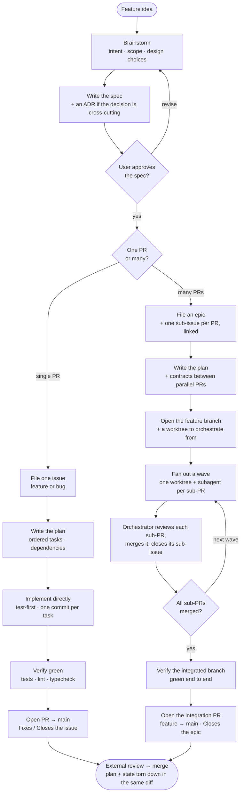

# feature-dev-workflow

A Claude Code plugin that packages an end-to-end **feature-development workflow** as a
set of composable, cross-referencing skills:

> brainstorm → spec (+ ADR) → GitHub issues → plan (+ contracts) → develop
> (single PR **or** parallel worktree fan-out) → review → pull request → ship

The skills choreograph the whole arc. You invoke one at feature conception
(`feature-dev-workflow:planning-a-feature`) and the `**REQUIRED SUB-SKILL:**` markers
walk you to the next at each step.

## Skills

| Skill | Use when |
| --- | --- |
| `planning-a-feature` | At feature conception — before any code, issue, or plan. Sequences brainstorm → spec → issues → plan. |
| `writing-github-issues` | About to `gh issue create`/`edit`, or right after a brainstorm that needs an issue. Templates for bug / feature / epic. |
| `developing-a-feature` | Starting implementation against a committed plan. Routes single-PR vs multi-PR. |
| `fanning-out-with-worktrees` | An orchestrator dispatching parallel subagents into per-PR worktrees off a feature branch. |
| `reviewing-feature-progress` | Orchestration checkpoints — between fan-out waves and before the integration PR. |
| `testing-a-feature` | Writing tests for any non-trivial change — deciding the assertion shape (black-box against the contract). |
| `opening-a-pull-request` | About to `gh pr create`/`edit`. Draft + ready body templates, issue-linking keywords. |

## How it works

The flow forks once — on whether the work ships as **one PR** or **many** — and rejoins
at the merge. A single PR runs straight through; a multi-PR feature opens a long-lived
feature branch and fans the sub-PRs out across isolated worktrees, one wave at a time,
with an alignment checkpoint between waves.



You invoke `feature-dev-workflow:planning-a-feature` at conception; it and the
`**REQUIRED SUB-SKILL:**` markers inside each skill body walk you through the rest. The
[`templates/project-CLAUDE.md`](templates/project-CLAUDE.md) paste-in maps each part of
the flow to the skill that owns it.

## Prerequisites

This plugin **depends on the [superpowers](https://github.com/obra/superpowers) plugin**
and references its skills directly (`superpowers:brainstorming`, `superpowers:writing-plans`,
`superpowers:test-driven-development`, `superpowers:verification-before-completion`,
`superpowers:dispatching-parallel-agents`). It also uses superpowers' `docs/superpowers/{specs,plans}/`
path convention. Install superpowers first.

The skills also assume the [`gh`](https://cli.github.com/) CLI is installed and authenticated.

## Install

This repo is both a plugin and its own single-plugin marketplace:

```
/plugin marketplace add <your-git-host>/feature-dev-workflow
/plugin install feature-dev-workflow@feature-dev-workflow
```

(Local path also works for development: `/plugin marketplace add /path/to/feature-dev-workflow`.)

## Configure your project

The skills are project-agnostic: repo-specific values are left as placeholders that you wire
up **once per consuming project**.

| Placeholder       | Replace with                                            |
| ----------------- | ------------------------------------------------------- |
| `<OWNER>/<REPO>`  | your GitHub repo slug (e.g. `octocat/hello-world`)      |
| `<TEST_CMD>`      | your test command (e.g. `make test`, `npm test`)        |
| `<LINT_CMD>`      | your lint command (e.g. `make lint`, `npm run lint`)    |
| `<TYPECHECK_CMD>` | your typecheck command, or drop the references if N/A   |

The recommended way to wire these is to **paste [`templates/project-CLAUDE.md`](templates/project-CLAUDE.md)
into your project's `CLAUDE.md`** and fill in the four values there — that file also carries the
workflow overview diagram and the portable operational rules (TDD, commit conventions, GitHub-mutation
confirmation, etc.).

The skills reference the placeholders by name, so once they're defined in your `CLAUDE.md`, the
skills resolve them in context. If you'd rather bake literal values into the skill text instead,
the placeholders are plain strings — a one-time find/replace works:

```sh
# from a clone of this plugin, before publishing your own fork
grep -rl '<OWNER>/<REPO>' skills | xargs sed -i 's#<OWNER>/<REPO>#octocat/hello-world#g'
```

## Notes

- Intra-plugin skill references are namespaced (`feature-dev-workflow:<name>`).
- Skill bodies reference their own templates via `${CLAUDE_PLUGIN_ROOT}` so paths resolve
  after the plugin is copied into the install cache.

## License

MIT — see [LICENSE](LICENSE).
