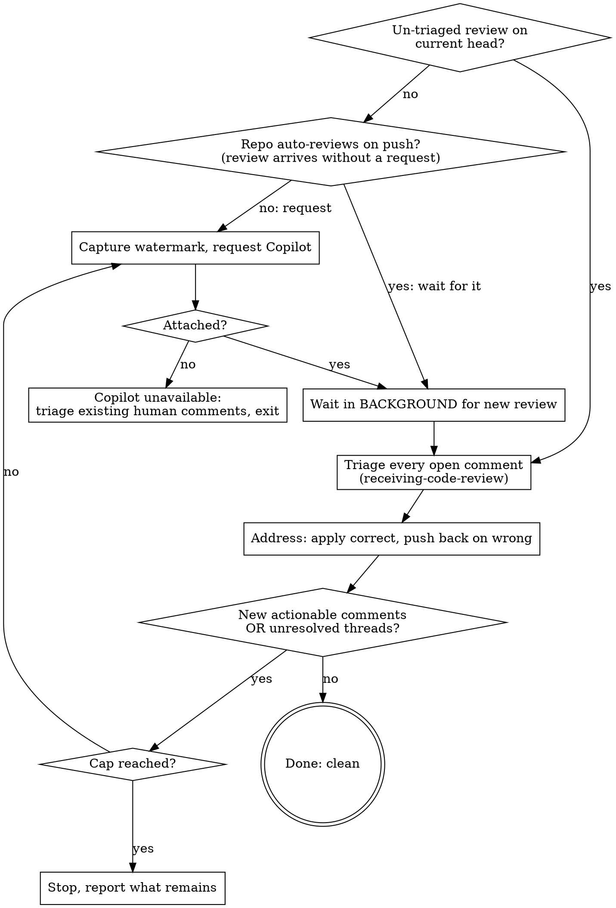

# review-loop

## When to invoke

When the user asks to loop a PR through automated review until it is clean — "run a review loop on #N", "get Copilot to review this and address everything", "keep requesting review until it's resolved". Also invoked from the two opt-in gates in `feature-dev-workflow:developing-a-feature` (sub-PRs, and the PR to main).

Not for a single one-off review pass — that is the `review` skill (local diff review) or a single `gh pr edit --add-reviewer`. This skill is the *loop*: request, wait, triage, address, re-request, until clean.

## The mechanism (verified — do not improvise the commands)

Copilot review is requested **only** through `gh pr edit`. The REST `requested_reviewers` endpoint rejects Copilot (it accepts human logins and team slugs only), so `gh api .../requested_reviewers -f "reviewers[]=copilot-..."` returns 422. Use:

```
gh pr edit <pr> --add-reviewer "@copilot"
```

Requires `gh` ≥ 2.88.0 (`gh --version`). Not available on GitHub Enterprise Server.

| Need | Command / identity |
| --- | --- |
| Request the review (first round) | `gh pr edit <pr> --add-reviewer "@copilot"` |
| Re-request after Copilot already reviewed | `gh pr edit <pr> --remove-reviewer "@copilot"` then `--add-reviewer "@copilot"`. Re-requesting is **unreliable** — it sometimes produces a fresh review (even on the same commit) and sometimes silently does nothing. Never assume it fired; confirm by watermark (next row). |
| Confirm a *new* review actually arrived | a Copilot review in `/pulls/<pr>/reviews` with `submitted_at` newer than the watermark you captured before re-requesting. This is the only reliable signal — not the exit code of `gh pr edit`. |
| Confirm it attached (gh can exit 0 without attaching) | `gh pr view <pr> --json reviewRequests` → expect a reviewer with login `Copilot` |
| Copilot's author login in `/pulls/<pr>/reviews` | `copilot-pull-request-reviewer[bot]` (this is the watermark filter) |
| List open review threads | `gh api graphql` on `PullRequest.reviewThreads` → `id`, `isResolved`, `viewerCanResolve` |
| Resolve a thread | `gh api graphql` mutation `resolveReviewThread(input:{threadId:"<id>"})` (GraphQL only; no REST) |
| Reply in a comment thread | `gh api repos/{owner}/{repo}/pulls/{pr}/comments/{id}/replies -f body=...` |

## The loop



**On entry, before the first request — take stock.** Before you touch the reviewer, look at what is already on the PR:

- **An un-triaged review on the current head is this round's review — triage it, do not request another.** List Copilot reviews (`gh api .../pulls/<pr>/reviews`, author `copilot-pull-request-reviewer[bot]`) and the open threads. If a Copilot review already covers the current head commit and its comments are unaddressed, go straight to triage (Step 4). Firing `--add-reviewer` on top of an un-triaged review just duplicates the request and re-surfaces the same comments.
- **If the repo auto-reviews on push, pushing is the trigger — never stack an explicit request on it.** Check the PR timeline for "review requested due to automatic review settings", or a ruleset that runs Copilot review on push. When that is on, a push produces the review by itself, so an explicit `--add-reviewer` on top double-fires. This is the same rule Step 6 relies on for re-requests, applied to the first request too.

Fall through to Step 1's explicit request only when there is nothing current to triage **and** a push will not produce the review for you — the PR has never been reviewed and the repo does not auto-review, or the only existing review predates the latest push (its comments are on stale code).

One cycle, in order:

1. **Capture the watermark, then request — only when the entry check says you need to.** `SINCE=$(date -u +%Y-%m-%dT%H:%M:%SZ)` *before* `gh pr edit <pr> --add-reviewer "@copilot"`. The watermark is what distinguishes the new review from a stale one left by an earlier round. Skip this step and go straight to triage (Step 4) when a current un-triaged review already exists, or when a push you are about to make will auto-trigger the review.
2. **Confirm Copilot attached.** `gh pr view <pr> --json reviewRequests`. If Copilot is **not** in the list, it is unavailable for this repo/plan (or `gh` is too old / this is GHES). Do **not** start waiting — there is no reviewer to produce a review. Instead do one triage pass over any human comments already on the PR (Step 3), state that Copilot review is unavailable, and exit. There is no loop without an automated reviewer to re-request.
3. **Wait in the background.** Launch the wait script with `run_in_background: true` so the session is not held hostage:

   ```
   ${CLAUDE_PLUGIN_ROOT}/skills/review-loop/templates/await-copilot-review.sh <pr> "$SINCE"
   ```

   It polls `gh api .../pulls/<pr>/reviews` for a Copilot review newer than `$SINCE` and exits 0 (printing the review) when one lands, or 124 on timeout. The harness re-invokes the session when it exits. Do **not** write a foreground `sleep`/`until` loop — foreground sleep is blocked and it freezes the session.
4. **Triage every open review comment** — Copilot's new ones plus any human comments already on the PR. **REQUIRED SUB-SKILL:** `superpowers:receiving-code-review`. Verify each against the codebase. No performative agreement, no blind implementation. Copilot is confidently wrong often enough that "apply all suggestions" is the wrong default.
5. **Address.** Apply the comments that are correct, one at a time, testing each; reply in the comment thread stating what changed; resolve the thread (`resolveReviewThread`). For a comment that is wrong or a judgment call, **do not silently apply or silently ignore** — handle the pushback per the calling context (below).
6. **Re-request and loop.** Capture a fresh watermark *first*, then commit and push the fixes (commit convention from the project's CLAUDE.md). Now **wait before re-requesting** — launch the background wait (Step 3) against that watermark:

   - **A repo that runs Copilot review on every push will produce the new review from the push alone.** Waiting first lets that auto-review land and counts it (it is newer than the pre-push watermark). Re-requesting on top of it would double the review — so do not re-request until the wait has had a chance to catch a push-triggered review.
   - **What a wait timeout means depends on whether the repo auto-reviews on push — and only one case authorizes a re-trigger.** On a repo that auto-reviews on push, the push already queued the review, so a timeout means it is *latent, not absent* (auto-review can lag the push by hours). Re-triggering then stacks a second review of the same commit — do **not** re-trigger; stop and report that the push-triggered review is still pending and will land on its own schedule, and the user can resume the loop when it appears. Re-trigger explicitly with **remove-then-re-add** (`gh pr edit <pr> --remove-reviewer "@copilot"` then `--add-reviewer "@copilot"` — a plain re-add often no-ops once Copilot has already reviewed) **only** when the repo does *not* auto-review on push, so the push genuinely will not produce a review by itself; then launch the wait once more.

   When a new review lands (from either path), return to Step 4.

   **If the second wait also times out, STOP — do not spin.** Re-requesting is inherently unreliable (GitHub exposes no dependable programmatic re-review; Copilot does not reliably auto-review on push either). Report that automated re-review could not be triggered and point the user at the robust path: enable a **repo ruleset that runs Copilot code review on every push**, which makes the loop reliable, or click the re-request (🔄) icon in the PR's Reviewers menu. Do not loop further against a reviewer that isn't responding.

## Termination

Stop and declare clean when **both**:

- a fresh Copilot review (newer than the latest watermark) returns **no new actionable comments**, AND
- every review thread is **resolved or replied** (a verified-and-declined comment with a stated reason counts as resolved — do not thrash re-litigating it).

**Safety cap: 3 request→address rounds.** If the loop has not converged by the cap, **stop** and report what remains unresolved. Do not raise the cap to keep going — non-convergence (Copilot surfacing churny or contradictory nits round after round) is a signal to hand back to the user, not to loop harder. Only count a review as "clean" if it arrived *after* your last push; a review from before the push is stale and must not end the loop.

**Stop early if a re-request can't be triggered.** Separate from the convergence cap: if a round's re-request (Step 6) produces no new review before the wait times out, stop and report rather than retrying blindly. Re-review is not reliably automatable; the durable fix is the on-push Copilot ruleset. Also expect that when a re-review *does* fire, Copilot may repeat comments you already addressed or dismissed — re-verify against the current diff rather than assuming a repeated comment is a new problem.

## Pushback handling depends on the calling context

The skill is told its context when invoked. This controls Step 5 pushback only.

- **Standalone, or the PR-to-main gate (interactive):** pause and surface the pushback to the user with technical reasoning, then act on their direction.
- **Autonomous multi-PR fan-out (sub-PR gate):** do **not** pause interactively — that breaks "autonomous fan-out has no per-sub-PR round-trips". Log the pushback as a bubble-up concern in the state file's `## Bubble-up log`, apply the rest, and let `feature-dev-workflow:reviewing-feature-progress` surface it at the wave checkpoint.

## GitHub-mutation discipline

Requesting the reviewer, replying in threads, resolving threads, and pushing are GitHub mutations. Follow the project rule: no mutation without a fresh confirmation against the specific thing about to land, in the interactive contexts. In autonomous fan-out, follow the autonomous-mode discipline already established for sub-PRs (the user opted into the mechanical bundle up front).

## What this skill does not do

- **Does not merge the PR.** It drives the PR to review-clean and hands back.
- **Does not invent comments or run its own static analysis.** Copilot and humans are the reviewers; this skill is the loop and the judgment layer over their output.
- **Does not block on human reviewers.** It sweeps in human comments already present, but only re-requests Copilot.

## Red flags

| Thought | Reality |
| --- | --- |
| "I'll `gh api .../requested_reviewers` to add Copilot" | That endpoint rejects Copilot (422). Only `gh pr edit --add-reviewer "@copilot"` works. |
| "I'll `sleep` in a loop until the review lands" | Foreground sleep is blocked and freezes the session. Use the background wait script; the harness wakes you. |
| "The command exited 0, so Copilot is reviewing" | `gh pr edit` can exit 0 without attaching. Confirm via `reviewRequests` before waiting. |
| "Copilot suggested it, so apply it" | Copilot is confidently wrong often. Triage via `receiving-code-review`; verify before applying. |
| "Still finding nits — one more round" | Past the 3-round cap, non-convergence is a signal to hand back, not to loop harder. |
| "A Copilot review exists, so we're clean" | Only a review *after your last push* counts. An earlier-round review is stale. |
| "There's already a review on the PR, but I'll request a fresh one to be safe" | An un-triaged review on the current head IS this round's review — triage it first. A new request duplicates it and re-surfaces the same comments. Request only when there is nothing current to act on. |
| "I re-added Copilot, so a fresh review is coming" | Re-request is unreliable and a plain re-add often no-ops after Copilot already reviewed. Use remove-then-re-add, and confirm a new review by watermark — if none arrives before the wait times out, stop and recommend the on-push ruleset. |
| "I pushed the fixes, now re-request immediately" | If the repo auto-reviews on push, the push already triggers a review; an immediate re-request doubles it. Capture the watermark before pushing, wait for the push-triggered review first, and re-request explicitly only on a repo that does *not* auto-review on push. |
| "The wait timed out, so re-trigger the review" | On an auto-review-on-push repo a timeout means the review is *latent* (it can lag hours), not absent — re-triggering stacks a second review. Stop and report it is pending; only re-trigger when the repo does not auto-review on push. |
| "Copilot raised this again, so it's a new problem" | A re-review may repeat comments you already addressed or dismissed. Re-verify against the current diff before acting. |
| "I'll auto-dismiss the comment I disagree with" | Wrong/judgment-call comments get pushback (interactive) or a bubble-up concern (fan-out) — never a silent drop. |
