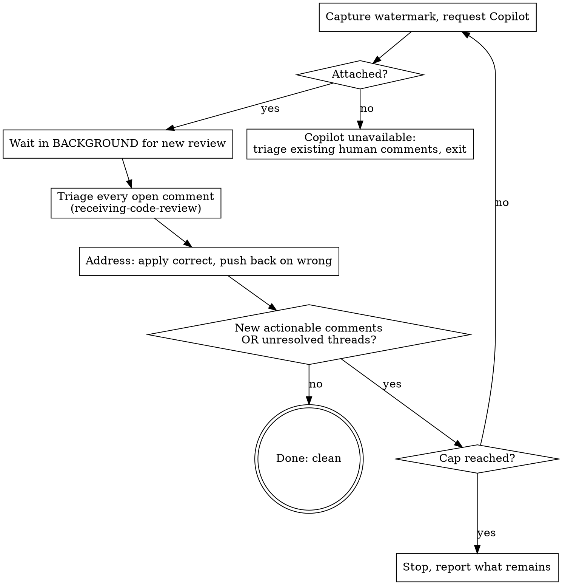

# review-loop

## When to invoke

When the user asks to loop a PR through automated review until it is clean — "run a review loop on #N", "get Copilot to review this and address everything", "keep requesting review until it's resolved". Also invoked from the two opt-in gates in `feature-dev-workflow:developing-a-feature` (sub-PRs, and the PR to main).

Not for a single one-off review pass — that is the `review` skill (local diff review) or a single `gh pr edit --add-reviewer`. This skill is the *loop*: request, wait, triage, address, re-request, until clean.

## The mechanism (verified — do not improvise the commands)

Copilot review is requested **only** through `gh pr edit`. The REST `requested_reviewers` endpoint rejects Copilot (it accepts human logins and team slugs only), so `gh api .../requested_reviewers -f "reviewers[]=copilot-..."` returns 422. Use:

```
gh pr edit <pr> --add-reviewer "@copilot"
```

Requires `gh` ≥ 2.88.0 (`gh --version`). Not available on GitHub Enterprise Server.

| Need | Command / identity |
| --- | --- |
| Request the review | `gh pr edit <pr> --add-reviewer "@copilot"` |
| Confirm it attached (gh can exit 0 without attaching) | `gh pr view <pr> --json reviewRequests` → expect a reviewer with login `Copilot` |
| Copilot's author login in `/pulls/<pr>/reviews` | `copilot-pull-request-reviewer[bot]` (this is the watermark filter) |
| List open review threads | `gh api graphql` on `PullRequest.reviewThreads` → `id`, `isResolved`, `viewerCanResolve` |
| Resolve a thread | `gh api graphql` mutation `resolveReviewThread(input:{threadId:"<id>"})` (GraphQL only; no REST) |
| Reply in a comment thread | `gh api repos/{owner}/{repo}/pulls/{pr}/comments/{id}/replies -f body=...` |

## The loop



One cycle, in order:

1. **Capture the watermark, then request.** `SINCE=$(date -u +%Y-%m-%dT%H:%M:%SZ)` *before* `gh pr edit <pr> --add-reviewer "@copilot"`. The watermark is what distinguishes the new review from a stale one left by an earlier round.
2. **Confirm Copilot attached.** `gh pr view <pr> --json reviewRequests`. If Copilot is **not** in the list, it is unavailable for this repo/plan (or `gh` is too old / this is GHES). Do **not** start waiting — there is no reviewer to produce a review. Instead do one triage pass over any human comments already on the PR (Step 3), state that Copilot review is unavailable, and exit. There is no loop without an automated reviewer to re-request.
3. **Wait in the background.** Launch the wait script with `run_in_background: true` so the session is not held hostage:

   ```
   ${CLAUDE_PLUGIN_ROOT}/skills/review-loop/templates/await-copilot-review.sh <pr> "$SINCE"
   ```

   It polls `gh api .../pulls/<pr>/reviews` for a Copilot review newer than `$SINCE` and exits 0 (printing the review) when one lands, or 124 on timeout. The harness re-invokes the session when it exits. Do **not** write a foreground `sleep`/`until` loop — foreground sleep is blocked and it freezes the session.
4. **Triage every open review comment** — Copilot's new ones plus any human comments already on the PR. **REQUIRED SUB-SKILL:** `superpowers:receiving-code-review`. Verify each against the codebase. No performative agreement, no blind implementation. Copilot is confidently wrong often enough that "apply all suggestions" is the wrong default.
5. **Address.** Apply the comments that are correct, one at a time, testing each; reply in the comment thread stating what changed; resolve the thread (`resolveReviewThread`). For a comment that is wrong or a judgment call, **do not silently apply or silently ignore** — handle the pushback per the calling context (below).
6. **Re-request and loop.** Commit and push the fixes (commit convention from the project's CLAUDE.md), then return to Step 1 with a fresh watermark.

## Termination

Stop and declare clean when **both**:

- a fresh Copilot review (newer than the latest watermark) returns **no new actionable comments**, AND
- every review thread is **resolved or replied** (a verified-and-declined comment with a stated reason counts as resolved — do not thrash re-litigating it).

**Safety cap: 3 request→address rounds.** If the loop has not converged by the cap, **stop** and report what remains unresolved. Do not raise the cap to keep going — non-convergence (Copilot surfacing churny or contradictory nits round after round) is a signal to hand back to the user, not to loop harder. Only count a review as "clean" if it arrived *after* your last push; a review from before the push is stale and must not end the loop.

## Pushback handling depends on the calling context

The skill is told its context when invoked. This controls Step 5 pushback only.

- **Standalone, or the PR-to-main gate (interactive):** pause and surface the pushback to the user with technical reasoning, then act on their direction.
- **Autonomous multi-PR fan-out (sub-PR gate):** do **not** pause interactively — that breaks "autonomous fan-out has no per-sub-PR round-trips". Log the pushback as a bubble-up concern in the state file's `## Bubble-up log`, apply the rest, and let `feature-dev-workflow:reviewing-feature-progress` surface it at the wave checkpoint.

## GitHub-mutation discipline

Requesting the reviewer, replying in threads, resolving threads, and pushing are GitHub mutations. Follow the project rule: no mutation without a fresh confirmation against the specific thing about to land, in the interactive contexts. In autonomous fan-out, follow the autonomous-mode discipline already established for sub-PRs (the user opted into the mechanical bundle up front).

## What this skill does not do

- **Does not merge the PR.** It drives the PR to review-clean and hands back.
- **Does not invent comments or run its own static analysis.** Copilot and humans are the reviewers; this skill is the loop and the judgment layer over their output.
- **Does not block on human reviewers.** It sweeps in human comments already present, but only re-requests Copilot.

## Red flags

| Thought | Reality |
| --- | --- |
| "I'll `gh api .../requested_reviewers` to add Copilot" | That endpoint rejects Copilot (422). Only `gh pr edit --add-reviewer "@copilot"` works. |
| "I'll `sleep` in a loop until the review lands" | Foreground sleep is blocked and freezes the session. Use the background wait script; the harness wakes you. |
| "The command exited 0, so Copilot is reviewing" | `gh pr edit` can exit 0 without attaching. Confirm via `reviewRequests` before waiting. |
| "Copilot suggested it, so apply it" | Copilot is confidently wrong often. Triage via `receiving-code-review`; verify before applying. |
| "Still finding nits — one more round" | Past the 3-round cap, non-convergence is a signal to hand back, not to loop harder. |
| "A Copilot review exists, so we're clean" | Only a review *after your last push* counts. An earlier-round review is stale. |
| "I'll auto-dismiss the comment I disagree with" | Wrong/judgment-call comments get pushback (interactive) or a bubble-up concern (fan-out) — never a silent drop. |
