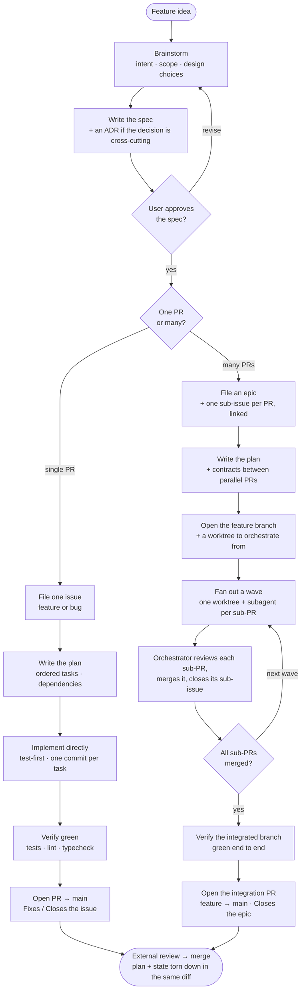

<!--
Paste this block into your project's CLAUDE.md (or AGENTS.md) after installing the
feature-dev-workflow plugin. It gives every Claude session the orchestration overview
and the operational rules. No placeholders to fill in; the skills discover your repo
and your test/lint/typecheck commands from context. Delete this comment after pasting.
-->

## Feature-development workflow

This project uses the `feature-dev-workflow` plugin. Invoke `feature-dev-workflow:planning-a-feature` at feature conception and let the cross-references fan out from there.

Invoke `feature-dev-workflow:planning-a-feature` at conception. It and the `**REQUIRED SUB-SKILL:**` markers inside each skill body drive every box above. Which skill owns which part of the flow:

| Part of the flow | Skill |
| --- | --- |
| Brainstorm → spec → issues → plan → state file | `feature-dev-workflow:planning-a-feature` (calls `superpowers:brainstorming`, `feature-dev-workflow:writing-github-issues`, `superpowers:writing-plans`) |
| Implement (single or multi-PR) | `feature-dev-workflow:developing-a-feature` (with `superpowers:test-driven-development` + `feature-dev-workflow:testing-a-feature`) |
| The worktree fan-out loop + wave merges | `feature-dev-workflow:fanning-out-with-worktrees` |
| Checkpoints between waves & before the integration PR | `feature-dev-workflow:reviewing-feature-progress` |
| End-to-end tests for a new user/consumer-visible flow (once structurally complete) | `feature-dev-workflow:testing-end-to-end` |
| Verify-before-done | `superpowers:verification-before-completion` |
| Open / flip pull requests | `feature-dev-workflow:opening-a-pull-request` |

`superpowers:*` skills come from the [superpowers](https://github.com/obra/superpowers) plugin (a prerequisite, see below).

### Project commands (optional)

The skills run your project's checks before claiming work done, discovering the commands from this file, the build config (Makefile, package.json, …), or `gh` (for the repo). If your test / lint / typecheck commands aren't obvious from the build config, name them here so sessions don't have to guess:

- **Test:** `<your test command>`
- **Lint:** `<your lint command>`
- **Typecheck:** `<your typecheck command, or remove this line>`

### Operational rules

The skills teach the workflow discipline when invoked — TDD, verify-before-done, the issue/PR conventions, PR-title hygiene, and the spec/plan/state lifecycle. Don't restate those here; a rule duplicated between this file and a skill drifts. This block carries only what a skill must read from here or can't enforce on its own:

- **Commit conventions:** `feat(<area>): ...`, `fix(<area>): ...`, `refactor(<area>): ...`, `test(<area>): ...`, `chore(<area>): ...`, `docs(<area>): ...`. Area mirrors the module path. (`feature-dev-workflow:opening-a-pull-request` reads this convention from here.)
- **Never `--no-verify`, never `git add -A` / `git add .`.** Stage by name; pre-commit hooks exist for a reason.
- **No GitHub mutation without a fresh confirmation against the specific body about to land.** Paste the body inline, name the target, wait for an explicit yes.
